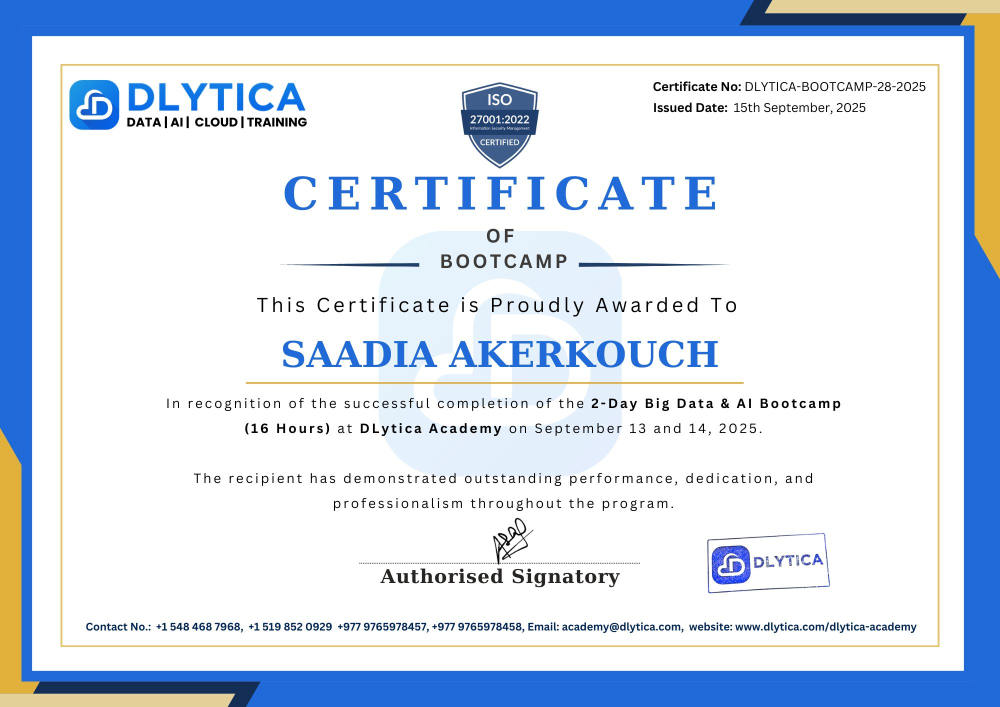

# DLytica-Bootcamp-BigData-AI
# DLytica - Bootcamp on Big Data & AI 🚀

This repository contains my participation in the **2-Day Online Bootcamp on Big Data & AI** organized by **DLytica - Data Analytics and AI**, supported by **Sunway College Kathmandu, Khwopa College of Engineering, IIMS College, and CSIT Association of Nepal**.

📅 **Date:** September 13 & 14, 2025  
📍 **Mode:** Online (Global Participation)

---

## 🎓 Certificate
Here is my official certificate of completion:  

---

## 📌 Bootcamp Overview
The bootcamp provided:  
- Hands-on tools and practical exercises in **Big Data & AI**  
- Insights from industry experts  
- Career guidance for aspiring data scientists and AI engineers  

---

## 🔗 References
- [DLytica Official Website](https://www.dlytica.com/)  
- [Bootcamp Recordings (YouTube Playlist)](https://studio.youtube.com/playlist/PLoeCTawXOhsMKcWB1KTFVaScXpyyIn1-R/videos)

---

✨ Proud to be part of this learning experience!
